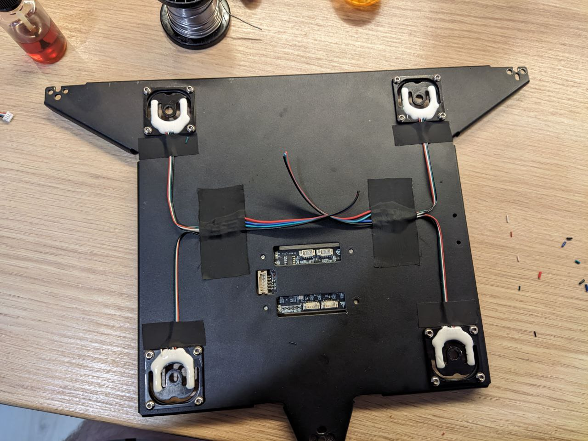
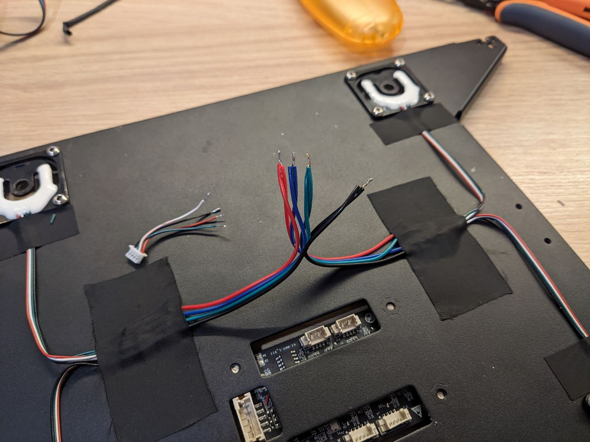
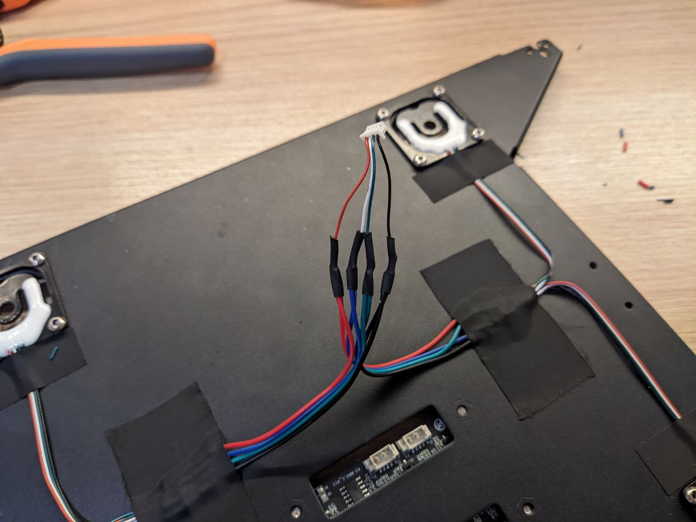
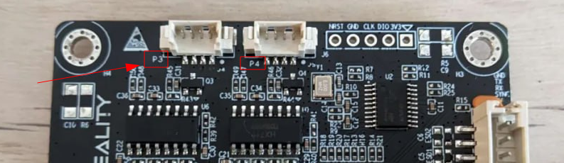

# Инструкция по настройке тензодатчиков на принтерах K1/K1MAX/K1C

[ENGLISH VERSION](README_ENG.md)

## 1. Железная часть. Перепайка тензодатчиков

Для корректной работы датчиков в клиппере необходимо снять стол, спаять тензодатчики параллельно и воткнуть в один из слотов. Номер слота запомнить/записать, номер видно на последней картинке.






_все фото (c) ZeyHex_

**Записать\запомнить в какой слот воткнули запараллеленные датчики!**

**N.B.** На K1 MAX плата повернута на 180 градусов, не как на фото. Считайте номер канала либо от основного большого разъема по часовой стрелке, либо ориентируйтесь на надписи на плате:


После всех работ собрать стол обратно.

## 2. Прошивочная часть. Подготовка прошивок.

Необходимо собрать новые прошивки для модуля стола, головы и основной платы. Либо собираем самостоятельно - либо скачиваем [отсюда](https://github.com/cryoz/K1_tenso_manual/tree/main/outfw)

Для компиляции прошивок нужен любой Linux, далее инструкция на примере Debian. 


    sudo apt install build-essential gcc-arm-none-eabi

    git clone https://github.com/cryoz/K1_Series_Klipper.git && cd K1_Series_Klipper
    ./build.sh

Если все пройдет без ошибок - появится папка outfw с тремя прошивками:

    bed_klipper.bin
    mcu_klipper.bin
    noz_klipper.bin

Закачайте их на принтер во временную папку, например `/usr/data/tenso/fw`

## 3. Установка mainline клиппера

Я использовал проект [K1-klipper](https://github.com/K1-Klipper/klipper) в большей степени из-за его легкой установки, а потом модернизировал необходимыми модулями. Но потом решил [форкнуть](https://github.com/cryoz/klipper) этот репозиторий, добавив сразу все необходимые модули от авторов [garethky](https://github.com/garethky) и [ZeyHex](https://t.me/ZeyHex)

Сбэкапьте всю папку с конфигом принтера (`/usr/data/printer_data/config`), можно через helper-script.

Для установки клиппера на принтер:

    cd /usr/data
    wget --no-check-certificate https://raw.githubusercontent.com/cryoz/installer_script_k1_and_max/main/installer.sh
    chmod +x installer.sh
    ./installer.sh

После окончания установки НЕ перезагружая принтер - закачать в папку `/usr/data/klipper/fw/K1` все три файла прошивки. Если прошивки были ранее скачаны в папку /usr/data/tenso: 

    cd /usr/data/tenso/fw && cp *.bin /usr/data/klipper/fw/K1/    

Нужно сбэкапить лог-файл прошивальщика штатных прошивок на случай несовпадения версий или ревизий:

    cp /tmp/mcu_update.log /usr/data/tenso/

**N.B.** если использовался скрипт Helper-script - нужно переустановить все модули, которые были установлены.

## 4. Настройка принтера

### 4.1 Бэкап
Сбэкапьте еще раз всю папку с конфигом принтера, можно через helper-script.

### 4.2 Конфигурация
В первую очередь необходимо убрать из printer.cfg все секции `[prtouch_v2]` `[prtouch_v1]` `[fan_feedback]`

Поправить настройки тенз в файле `/usr/data/printer_data/config/loadcell_probe.cfg` взяв нужные пины из слота в который воткнули перепаянную тензу из этой таблицы:

| Channel      | dout      |  sclk      |
|-------------:|:---------:|:----------:|
| 1            | PA0       | PA2        |
| 2            | PA1       | PA5        |
| 3            | PA3       | PA6        |
| 4            | PA4       | PA7        |


Меняем на нужные в конфиг-файле :

    [load_cell_probe]
    sensor_type: hx711
    dout_pin: leveling_mcu:PA4
    sclk_pin: leveling_mcu:PA7
Здесь тензодатчик воткнут в слот 4, пины вписаны соответствующие.

После этого добавить в printer.cfg файл настроек тензодатчиков:

    [include loadcell_probe.cfg]

После этого нужно перезапустить принтер **по питанию** - прошивки зашиваются только в этом случае.

Если клиппер выдал ошибки об устаревшем MCU - новые прошивки не зашились, смотреть лог прошивки в `/tmp/mcu_update.log`
Если выдал ошибки по конфигам - смотреть по месту: либо переустанавливать нужные модули через helper-script либо удалять встроенные секции креалити типа prtouch_v2.

Если все завелось и клиппер не показывает никаких ошибок - можно переходить к проверке тенз и их калибровке.

### 4.3 Проверка

для проверки работоспособности тензодатчиков нужно выполнить в консоли:

    $ LOAD_CELL_DIAGNOSTIC LOAD_CELL=load_cell_probe
    // Collecting load cell data for 10 seconds...
    // Samples Collected: 832
    // Measured samples per second: 83.7, configured: 80.0
    // Good samples: 832, Saturated samples: 0, Unique values: 464
    // Sample range: [0.49% to 0.50%]
    // Sample range / sensor capacity: 0.00257%

Если вывод похож на этот - значит тензы работают

### 4.4 Калибровка

Основная статья от автора:
https://github.com/garethky/klipper/blob/adc-endstop/docs/Load_Cell.md#calibrating-a-load-cell

Краткий пересказ. 
Убрать из рабочей области голову принтера, чтобы не мешала.

Запустить в консоли следующую команду:

    $ CALIBRATE_LOAD_CELL LOAD_CELL=load_cell_probe
    // Starting load cell calibration.
    // 1.) Remove all load and run TARE.
    // 2.) Apply a known load, run CALIBRATE GRAMS=nnn.
    // Complete calibration with the ACCEPT command.
    // Use the ABORT command to quit.

Далее:

    $ TARE
    // Load cell tare value: 0.53% (89146)
    // Now apply a known force to the load cell and enter the force value with:
    // CALIBRATE GRAMS=nnn

Записываем значение tare value: _89146_

Далее нужен предмет более 1кг и точные весы - взвешиваем предмет на весах, запоминаем и ставим предмет на стол принтера. Вводим команду (GRAMS - вес предмета в граммах):

    $ CALIBRATE GRAMS=1828
    // Calibration value: 0.25% (42719), Counts/gram: 25.39770, Total capacity: +/- 657.07Kg
    // ERROR: Tare and Calibration readings are less than 1% different!
    // Use more force when calibrating or a higher sensor gain.
    !! ERROR: Tare and Calibration readings are less than 1% different!

Из-за особенностей тензодатчиков на K1 и реализации алгоритма и калибровки в клиппере - эта ошибка норма. Записываем значение Counts/gram: _25.39770_

Получившиеся значения вписываем в конфиг тензодатчиков loadcell_probe.cfg:

    reference_tare_counts: 89146
    counts_per_gram: 25.39770

Вписываем в секцию `[stepper_z]` файла `printer.cfg` следующие изменения.
Вместо:

    endstop_pin: tmc2209_stepper_z:virtual_endstop# PA15   

Нужно прописать:    

    endstop_pin: probe:z_virtual_endstop

Сохраняем и перезапускаем клиппер.

Можно пробовать хоумиться, если все успешно - снимать карту.

Дальнейшая тонкая настройка тенз - через графики https://github.com/garethky/klipper/blob/adc-endstop/docs/Load_Cell.md#viewing-live-load-cell-graphs

## 5. Полезное

### 5.1 Скорость Z-Home

При штатной скорости Z-Home сопло втыкается в стол с усилием в 1.5кг, что не способствует здоровью ни стола ни покрытия ни сопла. Для уменьшения скорости хоминга добавить в секцию `[stepper_z]` параметр:
    
    homing_speed: 2

### 5.2 Компенсация температурного расширения 

Компенсация расширения сопла:
https://github.com/garethky/klipper/blob/adc-endstop-k1-debug/docs/Load_Cell_Probe.md#temperature-compensation

Замечание - в g_code тензопробы внесен лимит температуры сопла, выше которого она откажется работать - во избежания повреждения покрытия стола. Для настройки компенсации температурного расширения нужно **временно** увеличить параметр `PROBE_TEMP` в файле `loadcell_probe.cfg`:

    activate_gcode:
        
        
        
        

А после настройки вернуть обратно до 140-150 градусов.

### 5.3 Температурные датчики в каждом MCU

[ZeyHex](https://t.me/ZeyHex) добавил в прошивку чтение температуры с каждого из mcu из встроенных датчиков - что дало возможность мониторить температуру на контроллерах стола, головы и основной платы.
Для включения отображения температур нужно добавить сенсоры в `printer.cfg`:

    [temperature_sensor mcu_temp]
    sensor_type: temperature_mcu
    sensor_mcu: mcu
    min_temp: 0
    max_temp: 100

    [temperature_sensor nozzle_mcu_temp]
    sensor_type: temperature_mcu
    sensor_mcu: nozzle_mcu
    min_temp: 0
    max_temp: 100

    [temperature_sensor bed_mcu_temp]
    sensor_type: temperature_mcu
    sensor_mcu: leveling_mcu
    min_temp: 0
    max_temp: 100

### 5.4 Автоопределение Z-Offset совместно с тензодатчиками и любым датчиком BLTouch/Microprobe/Cartographer (! BETA !)

Для данного функционала пришлось пропатчить клиппер для возможности работы нескольких проб одновременно, а также написать плагин (`lc_auto_z_offset.py`) для клиппера с GCODE командой для определения Z-Offset. Чтобы включить эту возможность необходимо использовать ветку [multiprobe](https://github.com/cryoz/klipper/tree/multiprobe) из репозитория модифицированного mainline клиппера. 

Используется следующий конфиг:

    [load_cell_probe lc]
    sensor_type: hx711
    dout_pin: leveling_mcu:PA4
    sclk_pin: leveling_mcu:PA7
    z_offset: 0.0
    counts_per_gram: 25.39770
    reference_tare_counts: 89146
    safety_limit: 5000
    trigger_force: 160
    trigger_count: 1
    samples: 2
    speed: 2
    lift_speed: 5.0
    pullback_dist: 0.5
    pullback_speed: 0.2

    [lc_auto_z_offset]
    center_xy_position: 150.0,150.0
    secondary_probe: lc

Ключевой момент - именованный датчик уровня, в данном случае тензодатчик с именем `lc`. И это имя нужно указать в параметре `secondary_probe` в секции `[lc_auto_z_offset]`

Это дает возможность:
1. вызывать все команды для пробы добавляя префикс имени к команде, например проба с именем `lc` может вызывать GCode вида LCPROBE, LCPROBE_ACCURACY и так далее, при этом основная проба будет работать со стандартными командами (PROBE)
2. использовать автокалибровку Z-Offset через команду `LC_AUTO_Z_OFFSET`
3. использовать именованный датчик как концевик по оси Z: в секции `[stepper_z]` с подобным конфигом `endstop_pin: lc:z_virtual_endstop`, где  `lc` - имя вторичного датчика уровня

Это все работает не только с тензодатчиками, но с любым датчиком (и их количеством) которые имеют поддержку в клиппере.

Параметры команды `LC_AUTO_Z_OFFSET`:

`NOMOVE` - 0/1 (default 0) - не передвигаться при выполнении команды к точке, указанной в настройках плагина `center_xy_position` - а использовать текущую позицию

`SET` - 0/1 (default 0) - устанавливать вычисленный Z-Offset после выполнения команды

`SAVE` - 0/1 (default 0) - сохранять вычисленный Z-Offset в конфигурацию основной пробы

Остальные параметры передаются напрямую в команду PROBE вызываемую плагином.

Пример:

    LC_AUTO_Z_OFFSET NOMOVE=1 SAVE=1 SAMPLES=3 PROBE_SPEED=2

В текущем положении вычисляет Z-Offset с параметрами проб в 3 попытки со скоростью 2 и сохраняет вычисленное значение в конфиг основной пробы.

Пример вывода:
```
    // LC_AutoZOffset: Probing main probe ...
    // probe at 185.000,150.000 is z=0.798340
    // probe at 185.000,150.000 is z=0.800684
    // probe at 185.000,150.000 is z=0.799316
    // LC_AutoZOffset: Probing nozzle probe ...
    // probe at 150.000,150.000 is z=-0.019642
    // probe at 150.000,150.000 is z=-0.015027
    // probe at 150.000,150.000 is z=-0.012001
    // LC_AutoZOffset:
    // Nozzle: -0.016
    // Probe: 0.799
    // Diff: 0.815
    // Config Manual Adjust: 0.000
    // Total Calculated Offset: 0.815
```
**N.B.** 
- LC_AUTO_Z_OFFSET при запуске сбрасывает текущий Z-Offset в 0.0
- грейте стол и сопло до рабочих температур, но не выше 150 градусов на сопле во избежание повреждения покрытия стола соплом. Команда сама не греет стол и сопло


## 6. Credits

Авторы всех модификаций, алгоритмов и улучшений:
- [ZeyHex](https://t.me/ZeyHex) 
- [garethky](https://github.com/garethky)

Использованные репозитории:
- https://github.com/Klipper3d/klipper
- https://github.com/CrealityOfficial/K1_Series_Klipper
- https://github.com/garethky/klipper/tree/adc-endstop
- https://github.com/K1-Klipper/klipper
- https://github.com/K1-Klipper/installer_script_k1_and_max
- https://github.com/hawkeyexp/auto_offset_z


Статьи и материалы:
- https://klipper.discourse.group/t/strain-gauge-load-cell-based-endstops/2134
- https://github.com/Klipper3d/klipper/pull/6555

___

&copy; Cryo 2024 v1.2b