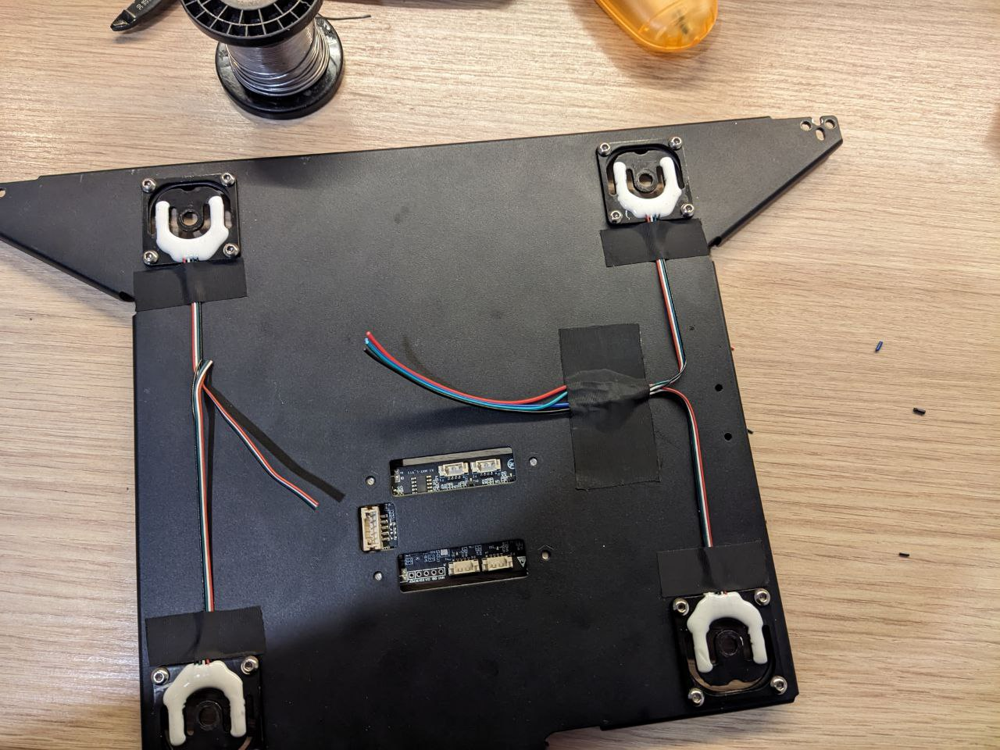

# Instructions for setting up load cells on K1/K1MAX/K1C printers

## 1. Hardware part. load cells wiring

For correct operation of the load cells it is necessary to remove the bed, solder the load cells in parallel and plug them into one of the channel connector. Remember/record the channel number, the number can be seen on the last picture.





_all photo by (c) ZeyHex_

**Record/remember which channel number the paralleled load cells were plugged into!**

**N.B.** On the K1 MAX, the board is rotated 180 degrees, not as pictured. Read the channel number either from the main large connector clockwise or refer to the inscriptions on the board:


After all operations, assemble the bed.

## 2. Firmware part.

It is necessary to build new firmware for the bed mcu, nozzle and main mcu. Either compile it yourself - or download it from [here](https://github.com/cryoz/K1_tenso_manual/tree/main/outfw)

For firmware compilation you need any Linux distro, here are the instructions using Debian as an example. 


    sudo apt install build-essential gcc-arm-none-eabi

    git clone https://github.com/cryoz/K1_Series_Klipper.git && cd K1_Series_Klipper
    ./build.sh

If everything builds without errors - the `outfw` folder with three firmwares will appear:

    bed_klipper.bin
    mcu_klipper.bin
    noz_klipper.bin

Download them to the printer in a temporary folder, e.g. `/usr/data/tenso/fw`

## 3. Setup mainline klipper

I used the [K1-klipper](https://github.com/K1-Klipper/klipper) project mostly because of its easy installation, and then modernized it with necessary modules. But then I decided to [fork](https://github.com/cryoz/klipper) this repository, adding all necessary modules from [garethky](https://github.com/garethky) and [ZeyHex](https://t.me/ZeyHex) at once

Backup the entire printer config folder (`/usr/data/printer_data/config`), you can do this via helper-script.

To install the klipper on the printer:

    cd /usr/data
    wget --no-check-certificate https://raw.githubusercontent.com/cryoz/installer_script_k1_and_max/main/installer.sh
    chmod +x installer.sh
    ./installer.sh

After the installation is complete, do NOT reboot the printer - download all three firmware files to the `/usr/data/klipper/fw/K1` folder. If the firmware files were previously downloaded to `/usr/data/tenso`:  

    cd /usr/data/tenso/fw && cp *.bin /usr/data/klipper/fw/K1/    

It is necessary to backup the log file of the firmware flasher of stock firmware in case of version or revision mismatch:

    cp /tmp/mcu_update.log /usr/data/tenso/

**N.B.** if the Helper-script was used - you need to reinstall all modules that were installed.

## 4. Printer setup

### 4.1 Backup
Backup the entire printer config folder again, you can use helper-script.

### 4.2 Config
First of all, remove all `[prtouch_v2]` `[prtouch_v1]` sections from printer.cfg.

Correct load cells settings in `/usr/data/printer_data/config/loadcell_probe.cfg` file by taking the required pins from the channel into which you soldered the resoldered load cells from this table:

| Channel      | dout      |  sclk      |
|-------------:|:---------:|:----------:|
| 1            | PA0       | PA2        |
| 2            | PA1       | PA5        |
| 3            | PA3       | PA6        |
| 4            | PA4       | PA7        |


Change to the required ones in the config file:

    [load_cell_probe]
    sensor_type: hx711
    dout_pin: leveling_mcu:PA4
    sclk_pin: leveling_mcu:PA7

Here the load cells are plugged into channel 4, the pins are configured accordingly.

Then add the load cell settings file to printer.cfg:

    [include loadcell_probe.cfg]

After that, you need to restart the printer by **powering off** - the firmware is only flashed in this case.


If the klipper gives errors about obsolete MCU - new firmware has not been flashed, look at the firmware log in `/tmp/mcu_update.log`.
If the klipper gave errors about configs - look locally: either reinstall the necessary modules via helper-script or delete stock creality sections like prtouch_v2.

If everything starts up and the klipper shows no errors, you can proceed to check the load cells and calibrate them.


### 4.3 Check

to check the functionality of the load cells, run in the console:

    $ LOAD_CELL_DIAGNOSTIC LOAD_CELL=load_cell_probe
    // Collecting load cell data for 10 seconds...
    // Samples Collected: 832
    // Measured samples per second: 83.7, configured: 80.0
    // Good samples: 832, Saturated samples: 0, Unique values: 464
    // Sample range: [0.49% to 0.50%]
    // Sample range / sensor capacity: 0.00257%

If the output is anything like this, then the load cells are working

### 4.4 Calibrate

Main docs from the author:
https://github.com/garethky/klipper/blob/adc-endstop/docs/Load_Cell.md#calibrating-a-load-cell

In short.
Remove the printer head from the work area so that it is out of the way.

Run in console:

    $ CALIBRATE_LOAD_CELL LOAD_CELL=load_cell_probe
    // Starting load cell calibration.
    // 1.) Remove all load and run TARE.
    // 2.) Apply a known load, run CALIBRATE GRAMS=nnn.
    // Complete calibration with the ACCEPT command.
    // Use the ABORT command to quit.

Then:

    $ TARE
    // Load cell tare value: 0.53% (89146)
    // Now apply a known force to the load cell and enter the force value with:
    // CALIBRATE GRAMS=nnn

Write the value `tare value`: _89146_

Next you need an item over 1kg and an accurate scale - weigh the item on the scale, memorize and place the item on the printer table. Run in console:

    $ CALIBRATE GRAMS=1828
    // Calibration value: 0.25% (42719), Counts/gram: 25.39770, Total capacity: +/- 657.07Kg
    // ERROR: Tare and Calibration readings are less than 1% different!
    // Use more force when calibrating or a higher sensor gain.
    !! ERROR: Tare and Calibration readings are less than 1% different!

Due to the peculiarities of the load cells on K1 and the implementation of the algorithm and calibration in the klipper - this error is normal. Write the value `Counts/gram`: _25.39770_

Enter the recorded values into the load cell configuration loadcell_probe.cfg:

    reference_tare_counts: 89146
    counts_per_gram: 25.39770

Write the following changes to the `[stepper_z]` section of the `printer.cfg` file.

Instead of:

    endstop_pin: tmc2209_stepper_z:virtual_endstop# PA15   

Write:    

    endstop_pin: probe:z_virtual_endstop

Save and restart klipper.

 
You can try homing, if all is successful - you can try to build a bed map.

Further fine-tuning of load cells - via graphs https://github.com/garethky/klipper/blob/adc-endstop/docs/Load_Cell.md#viewing-live-load-cell-graphs

## 5. Tweaks

### 5.1 Speed Z-Home

At the standard Z-Home speed, the nozzle is pushed into the bed with a force of 1.5kg, which is not conducive to the health of the bed, the coating or the nozzle. Add a parameter to the `[stepper_z]` section to reduce the homing speed:
    
    homing_speed: 2

### 5.2 Compensation for thermal expansion 

Nozzle expansion compensation:
https://github.com/garethky/klipper/blob/adc-endstop-k1-debug/docs/Load_Cell_Probe.md#temperature-compensation

Note - the g_code of the load cells contains a limit of nozzle temperature, above which it will refuse to work - to avoid damage to the bed coating. To set the temperature expansion compensation you should **temporarily** increase the `PROBE_TEMP` parameter in the `loadcell_probe.cfg` file:

    activate_gcode:
        
        
        
        

And after adjusting, bring it back up to 140-150 degrees.

### 5.3 Temperature sensors in all MCUs

[ZeyHex](https://t.me/ZeyHex) added to the firmware reading the temperature from each of the mcu from the built-in sensors - which made it possible to monitor the temperature on the bed, nozzle and main MCUs.
To enable temperature monitoring you need to add sensors to `printer.cfg`:


    [temperature_sensor mcu_temp]
    sensor_type: temperature_mcu
    sensor_mcu: mcu
    min_temp: 0
    max_temp: 100

    [temperature_sensor nozzle_mcu_temp]
    sensor_type: temperature_mcu
    sensor_mcu: nozzle_mcu
    min_temp: 0
    max_temp: 100

    [temperature_sensor bed_mcu_temp]
    sensor_type: temperature_mcu
    sensor_mcu: leveling_mcu
    min_temp: 0
    max_temp: 100

### 5.4 Auto Z-Offset calculation with load cells probe and any BLTouch/Microprobe/Cartographer probe (! BETA !)

For this functionality we had to patch Klipper to allow multiple probes to work simultaneously, as well as write a plugin (`lc_auto_z_offset.py`) for Klipper with GCODE command to determine Z-Offset. To enable this feature you need to use the [multiprobe](https://github.com/cryoz/klipper/tree/multiprobe) branch from the modified mainline klipper repository. 

Required config:

    [load_cell_probe lc]
    sensor_type: hx711
    dout_pin: leveling_mcu:PA4
    sclk_pin: leveling_mcu:PA7
    z_offset: 0.0
    counts_per_gram: 25.39770
    reference_tare_counts: 89146
    safety_limit: 5000
    trigger_force: 160
    trigger_count: 1
    samples: 2
    speed: 2
    lift_speed: 5.0
    pullback_dist: 0.5
    pullback_speed: 0.2

    [lc_auto_z_offset]
    center_xy_position: 150.0,150.0
    secondary_probe: lc

The key point is a **named** secondary probe, in this case a load cell probe named `lc`. And this name must be specified in the `secondary_probe` parameter in the `[lc_auto_z_offset]` section.


Possibilities:
- to call all commands for a probe by adding a name prefix to the command, for example a probe named `lc` can call GCode of the form LCPROBE, LCPROBE_ACCURACY and so on, while the main probe will work with standard commands (PROBE, PROBE_ACCURACY)
- use Z-Offset autocalibration via `LC_AUTO_Z_OFFSET` command
- use secondary probe as endstop in `[stepper_z]` section by using config like `endstop_pin: lc:z_virtual_endstop`, where `lc` - name of secondary probe

`LC_AUTO_Z_OFFSET` command parameters:

`NOMOVE` - 0/1 (default 0) - do not move when executing the command to the point specified in the plugin's `center_xy_position` settings - but use the current position

`SET` - 0/1 (default 0) - set the calculated Z-Offset after executing the command

`SAVE` - 0/1 (default 0) - save the calculated Z-Offset to the main probe configuration

The other parameters are passed directly to the PROBE command called by the plugin.

Example:

    LC_AUTO_Z_OFFSET NOMOVE=1 SAVE=1 SAMPLES=3 PROBE_SPEED=2

In the current position, calculates Z-Offset with probe parameters of 3 samples at speed 2 and stores the calculated value in the main probe config.

Output example:
```
    // LC_AutoZOffset: Probing main probe ...
    // probe at 185.000,150.000 is z=0.798340
    // probe at 185.000,150.000 is z=0.800684
    // probe at 185.000,150.000 is z=0.799316
    // LC_AutoZOffset: Probing nozzle probe ...
    // probe at 150.000,150.000 is z=-0.019642
    // probe at 150.000,150.000 is z=-0.015027
    // probe at 150.000,150.000 is z=-0.012001
    // LC_AutoZOffset:
    // Nozzle: -0.016
    // Probe: 0.799
    // Diff: 0.815
    // Config Manual Adjust: 0.000
    // Total Calculated Offset: 0.815
```

**N.B.** 
- LC_AUTO_Z_OFFSET resets the current Z-Offset to 0.0 on startup
- warm the bed and nozzle to operating temperatures, but no higher than 150 degrees at the nozzle to avoid damaging the bed coating. The command itself does not warm the table or nozzle.


## 6. Credits

Authors of all modifications, algorithms and improvements:
- [ZeyHex](https://t.me/ZeyHex) 
- [garethky](https://github.com/garethky)

Used repos:
- https://github.com/Klipper3d/klipper
- https://github.com/CrealityOfficial/K1_Series_Klipper
- https://github.com/garethky/klipper/tree/adc-endstop
- https://github.com/K1-Klipper/klipper
- https://github.com/K1-Klipper/installer_script_k1_and_max
- https://github.com/hawkeyexp/auto_offset_z

References:
- https://klipper.discourse.group/t/strain-gauge-load-cell-based-endstops/2134
- https://github.com/Klipper3d/klipper/pull/6555

___

&copy; Cryo 2024 v1.2b